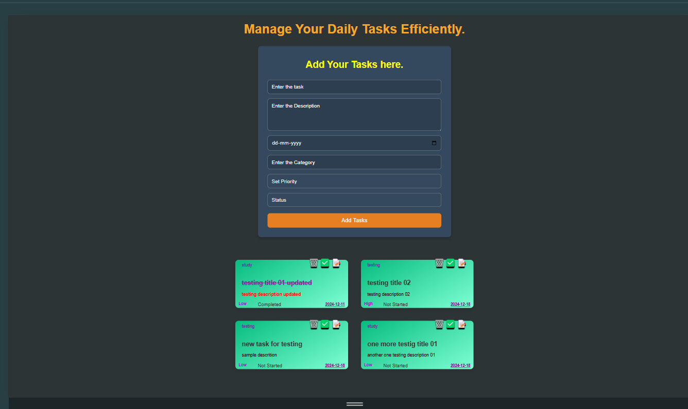
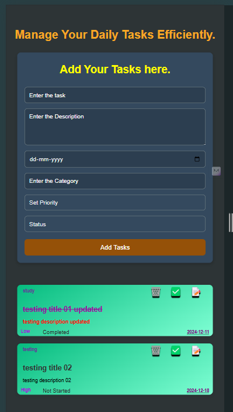

Here’s a sample `README.md` file for your Advanced Todo List project:  

```markdown
# Advanced Todo List

Manage your daily tasks efficiently with the **Advanced Todo List**. This application allows users to create, edit, and manage tasks with additional features like priority, status, category, and due date.

## Features

- Add tasks with details like title, description, due date, category, priority, and status.
- Mark tasks as completed or toggle their status.
- Update task details or delete tasks.
- Responsive design for mobile and desktop users.
- Tasks are saved in `localStorage` for persistent data.

## Technologies Used

- HTML5
- CSS3
- JavaScript

## How to Use

1. Clone the repository:
   ```bash
   git clone https://github.com/your-username/advanced-todo-list.git
   ```
2. Navigate to the project directory:
   ```bash
   cd advanced-todo-list
   ```
3. Open the `index.html` file in your browser to use the application.

## Project Structure

```
advanced-todo-list/
├── index.html         # Main HTML file
├── style.css          # Stylesheet
└── script.js          # JavaScript logic
```

## Features in Detail

### Adding Tasks
- Fill in the task title, description, due date, category, priority, and status in the form.
- Click the "Add Tasks" button to save the task.

### Updating and Deleting Tasks
- Use the 📝 button to edit a task (only available for tasks marked as "Not Started").
- Use the 🗑️ button to delete a task.

### Toggling Task Status
- Use the ✅ button to mark a task as "Completed" or revert it to "Not Started."

### Persistent Data
- All tasks are stored in `localStorage`, so your tasks remain intact even after refreshing the page.

## Screenshots

### Desktop View


### Mobile View


## Future Improvements

- Add filtering options to view tasks by priority or category.
- Implement drag-and-drop functionality for task reordering.
- Add user authentication for multi-device synchronization.

## Contributing

Contributions are welcome! Feel free to open issues or submit pull requests to improve this project.

## License

This project is licensed under the MIT License. See the [LICENSE](LICENSE) file for details.

## Author

- **[Akash]**  
  GitHub: (https://github.com/Akash7a)
```

### Notes:
- Add screenshots (`screenshot-desktop.png` and `screenshot-mobile.png`) to your repository if you want to include them in the README.
- Include a `LICENSE` file if you wish to make the project open source.